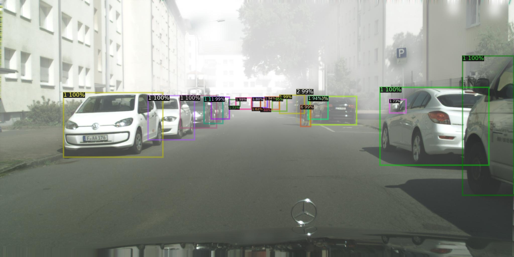

# Week 3 — Detectron2 安裝與降版

## 1. 環境安裝步驟說明
本次作業採用TWCC執行，映像檔選擇pytorch-23.08-py3:latest，型號選擇cm.super
1. 確認gcc
```!bash
gcc --version
```
gcc (Ubuntu 11.4.0-1ubuntu1~22.04) 11.4.0
2. 安裝套件detectron2==0.5
```!bash
pip install git+https://github.com/facebookresearch/detectron2.git@v0.5
```
3. 降Pillow套件版本
```!bash
pip uninstall pillow
pip install pillow==9.0.1
```
4. 下載資料集
* 
```!bash
scp -P TWCC對外埠 ./目標資料集  TWCC帳號@TWCC的IP:存放位置
tar -xvf 目標資料集
```

## 2. 遇到的問題及解決方法

1. 無法用TWCC直接掛載NAS獲取資料集，因此改用本地端先掛載NAS：
```!bash
net use Z: \\140.123.103.220\VIS_Lab /user:NAS帳號 密碼
cd "目標資料夾"
```
再上傳至TWCC中：
```!bash
scp -P TWCC對外埠 ./目標資料集  TWCC帳號@TWCC的IP:存放位置
```

## 3. 模型訓練與推論結果

* Foggy_Cityscapes

一開始使用原本的參數進行測試，訓練時長約2小時，以下為訓練與推論的結果截圖：



而後修改config參數再次進行測試，第一次修改IMS_PER_BATCH，由8改成4，訓練時長約2小時，以下為訓練與推論的結果截圖：


我們可以透過AP注意到了對於模型而言修改IMS_PER_BATCH並沒有太大的影響

然後再修改config參數進行再測試，第二次修改MAX_ITER，由24000改成8000，訓練時長約40分鐘，以下為訓練與推論的結果截圖：


我們可以透過AP注意到了對於模型而言修改MAX_ITER造成了些許影響，但同時我們可以看到訓練時長縮短了

## 4. 修改 config 的目的與成果

### 第一次修改：

第一次修改的目的主要是測試修改IMS_PER_BATCH的值能不能使模型學習效果更佳或是減少訓練時長，不過從結果來看效果並不明顯
### 第二次修改：

第二次修改的目的主要是測試修改MAX_ITER的值相較於第一次修改能不能使模型學習效果更佳或是減少訓練時長，而從數值上來看效果並不明顯，不過還是可以看到某些述職的改變，但是從訓練時長來看明顯縮短為了原本的三分之一，與修該MAX_ITER的幅度成正比

由以上兩次測試我們可以推測如果要模型學習效果更佳，需要降低IMS_PER_BATCH的值並提高MAX_ITER的值，不過訓練時間也會跟隨MAX_ITER成正比增加
